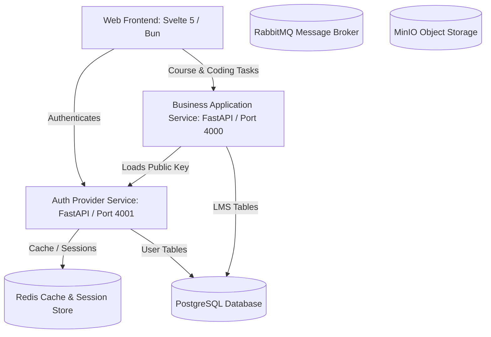

# LMS Online Coding Platform

A modern Learning Management System (LMS) and online coding platform designed with a microservices architecture. This repository is structured as a monorepo containing backend services (FastAPI), a frontend application (Svelte 5 & SvelteKit), and supporting local infrastructure (Docker Compose).

## Technology Stack

[](https://www.python.org/)
[](https://fastapi.tiangolo.com/)
[](https://svelte.dev/)
[](https://tailwindcss.com/)
[](https://bun.sh/)
[](https://github.com/astral-sh/uv)
[](https://www.docker.com/)

---

## Folder Structure

The repository organizes its backend services, frontend application, and environment configuration in a structured monorepo:

```text
LMS-coding-platform/
├── src/
│   ├── backend/
│   │   ├── auth-provider/         # Authentication & User Service (FastAPI + uv)
│   │   ├── business-application/  # Core LMS API (FastAPI + uv)
│   │   └── judge/                 # Code compilation sandbox (planned)
│   └── frontend/                  # Svelte 5 Web Application (SvelteKit + Bun)
├── docker-compose.yaml            # Local infrastructure stack definition
├── .env.example                   # Shared root environment template for Docker
└── README.md                      # General project instructions (this file)
```

---

## Architecture Overview



---

## Infrastructure Setup (Docker)

Before running the backend or frontend services locally, spin up the supporting storage and middleware engines using Docker.

### 1. Setup root environment variables
Copy the template `.env.example` in the root folder to `.env`:
```bash
cp .env.example .env
```
*(Optionally modify usernames or passwords inside `.env` to configure your local container stack).*

### 2. Start the infrastructure
Start the PostgreSQL, Adminer, Redis, RabbitMQ, and MinIO instances in the background:
```bash
docker compose up -d
```

### 3. Verify running containers
Ensure all containers are up and running:
```bash
docker compose ps
```

### 4. Local Service Ports & Endpoints
Once up, the following local services are available:

| Service | Port | Endpoint | Credentials / Details |
|---------|------|----------|----------------------|
| **PostgreSQL** | `5432` | `localhost:5432` | User: `lms`, Password: `change-me-postgres`, DB: `lms` |
| **Adminer** (DB UI) | `8080` | [http://localhost:8080](http://localhost:8080) | Server: `postgres`, Username: `lms` |
| **Redis** | `6379` | `localhost:6379` | Used for caching and user sessions |
| **RabbitMQ API** | `5672` | `localhost:5672` | Event broker connection string |
| **RabbitMQ Console** | `15672` | [http://localhost:15672](http://localhost:15672) | Username: `lms`, Password: `change-me-rabbitmq` |
| **MinIO API** | `9000` | `localhost:9000` | S3-compatible storage gateway |
| **MinIO Console** | `9001` | [http://localhost:9001](http://localhost:9001) | Username: `minioadmin`, Password: `minioadmin` |

### 5. Stop the infrastructure
To shut down and stop the infrastructure services:
```bash
docker compose down
```

---

## Services Setup & Development

Detailed, step-by-step setup guides for building, running, and testing each component are available in their respective service folders:

1. **Authentication Provider** (Backend): Read [auth-provider README](file:///home/cloud/workspace/python/LMS-coding-platform/src/backend/auth-provider/README.md)
2. **Business Application** (Backend): Read [business-application README](file:///home/cloud/workspace/python/LMS-coding-platform/src/backend/business-application/README.md)
3. **Web Frontend** (Svelte 5): Read [frontend README](file:///home/cloud/workspace/python/LMS-coding-platform/src/frontend/README.md)

> [!TIP]
> Always make sure that your root Docker stack is running before starting the development servers for the backend services.
