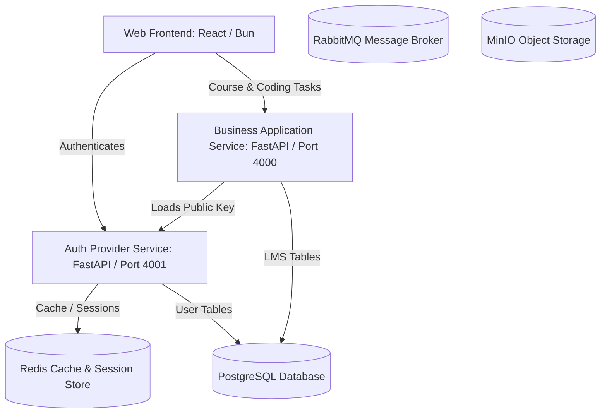

# LMS Online Coding Platform

A modern Learning Management System (LMS) and online coding platform designed with a microservices architecture. This repository is structured as a monorepo containing backend services (FastAPI), a frontend application (React & Vite), and supporting local infrastructure (Docker Compose).

## Technology Stack

[](https://www.python.org/)
[](https://fastapi.tiangolo.com/)
[](https://react.dev/)
[](https://tailwindcss.com/)
[](https://bun.sh/)
[](https://github.com/astral-sh/uv)
[](https://www.docker.com/)

---

## Folder Structure

The repository organizes its backend services, frontend application, and environment configuration in a structured monorepo:

```text
LMS-coding-platform/
├── src/
│   ├── backend/
│   │   ├── auth-provider/         # Authentication & User Service (FastAPI + uv)
│   │   ├── business-application/  # Core LMS API (FastAPI + uv)
│   │   └── judge/                 # Code compilation sandbox (planned)
│   └── frontend/                  # React Web Application (Vite + Bun)
├── docker-compose.yaml            # Local infrastructure stack definition
├── .env.example                   # Shared root environment template for Docker
└── README.md                      # General project instructions (this file)
```

---

## Architecture Overview


```mermaid
graph TD
    Client[Web Frontend: React / Bun]
    AuthSvc[Auth Provider Service: FastAPI / Port 4001]
    BizSvc[Business Application Service: FastAPI / Port 4000]
    
    DB[(PostgreSQL Database)]
    Cache[(Redis Cache & Session Store)]
    MQ[(RabbitMQ Message Broker)]
    S3[(MinIO Object Storage)]

    Client -->|Authenticates| AuthSvc
    Client -->|Course & Coding Tasks| BizSvc
    
    BizSvc -->|Loads Public Key| AuthSvc
    AuthSvc -->|Cache / Sessions| Cache
    AuthSvc -->|User Tables| DB
    BizSvc -->|LMS Tables| DB
    
    %% Future services connections
    %% BizSvc -->|Queues Code Run| MQ
    %% S3 -->|Stores Static Assets / Submissions| BizSvc
```

---

## Infrastructure Setup

This project now uses cloud-managed services for database and cache. The backend services should be configured to use Supabase for PostgreSQL and Upstash for Redis.

If you want to keep a local container stack for legacy or development testing, the `docker compose` files remain available, but they are not required for the current cloud-based setup.

### 1. Setup root environment variables
Copy the template `.env.example` in the root folder to `.env`:
```bash
cp .env.example .env
```

### 2. Cloud service configuration
Update `.env` values in each service folder to use:
- Supabase PostgreSQL connection string for `DATABASE_URL`
- Upstash Redis connection values for `UPSTASH_REDIS_REST_URL` and `UPSTASH_REDIS_REST_TOKEN`

### 3. Local Docker usage (optional)
If you still choose to use local Docker infrastructure for legacy or testing purposes, you may run:
```bash
docker compose up -d
```

### 4. Optional verification
If using local Docker, verify containers are running:
```bash
docker compose ps
```

### 5. Optional shutdown
To stop the local Docker infrastructure:
```bash
docker compose down
```

---

## Services Setup & Development

Detailed, step-by-step setup guides for building, running, and testing each component are available in their respective service folders:

1. **Authentication Provider** (Backend): Read [auth-provider README](file:///home/cloud/workspace/python/LMS-coding-platform/src/backend/auth-provider/README.md)
2. **Business Application** (Backend): Read [business-application README](file:///home/cloud/workspace/python/LMS-coding-platform/src/backend/business-application/README.md)
3. **Web Frontend** (React): Read [frontend README](file:///home/cloud/workspace/python/LMS-coding-platform/src/frontend/README.md)

> [!TIP]
> Always make sure that your root Docker stack is running before starting the development servers for the backend services.
