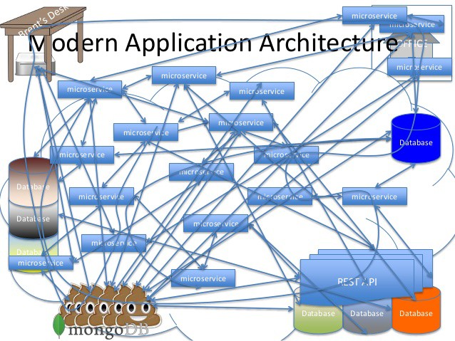

# HƯỚNG DẪN SỬ DỤNG GATEWAY TO CHAOS 
Một hệ thống microservice trung bình sẽ có tới hằng trăm services khác nhau, nếu như client giao tiếp trực tiếp với từng services thì sơ đồ giao tiếp giữa client và hệ thống của chúng ta sẽ như thế này: 

Chính vì cái nồi cám lợn như trên nên mới xuất hiện một giải pháp đó chính là API Gateway, đóng vai trò như một lớp trung gian giữa client và hệ thống microservice đứng sau 

## Các thay đổi 
Trong quá khú, hệ thống chúng ta có các services sau: 
- business-application: http://localhost:4000 
- auth-provider: http://localhost:4001 
- judge: http://localhost:4002 

Bây giờ tôi sẽ gom tất cả lại thành một endpoint duy nhất. Client chỉ cần thực hiện giao tiếp với 1 endpoint này. Endpoint này được tạo ra nhờ hệ thống gateway: 

## Hướng dẫn sử dụng 
Khởi động server gateway tại folder: `src/gateway` bằng câu lệnh `uv run main.py`. Hệ thống sẽ chạy tại `http://localhost:4040` 

Khởi động các services bằng câu lệnh quen thuộc `uv run main.py` ở từng thư mục, chúng ta sẽ có các service lần lượt khởi động ở các đường link sau. 
- business-application: http://localhost:4000 
- auth-provider: http://localhost:4001 
- judge: http://localhost:4002 

Cú pháp để chúng ta truy cập là: `http://localhost:4040/{service}/{path}` 

Với service lần lượt là: `business-application`, `auth-provider`, `judge`. Đây là các label. Gateway sẽ dựa vào nhãn này để routing request đến đúng service. path chính là path tương ứng của nó bên trong từng services (business-application, auth-provider, judge... Nó là cái api_spec.md mà code bữa giờ)

**Ví dụ**: `http://localhost:4040/business-application/docs` thì sẽ cho phép truy cập API docs của service business-application 

**Lưu ý**: Không thêm prefix /api vào bên trong path. Gateway sẽ tự thêm prefix phù hợp dựa trên loại service truy cập. 

Đường link đăng nhập: `http://localhost:4040/auth-provider/auth/authorize?redirect_uri=https://youtube.com`