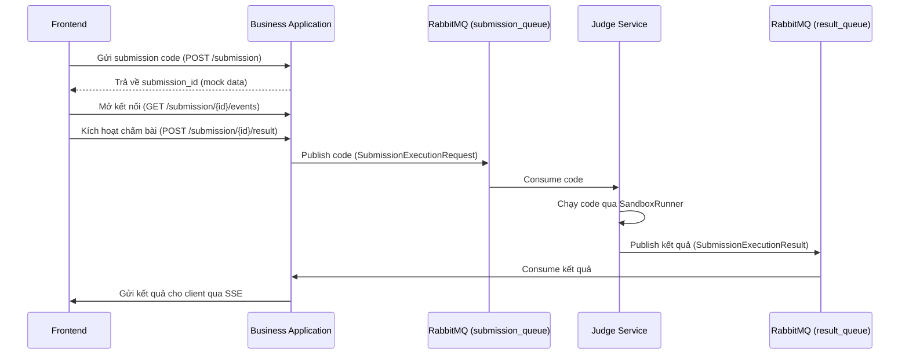
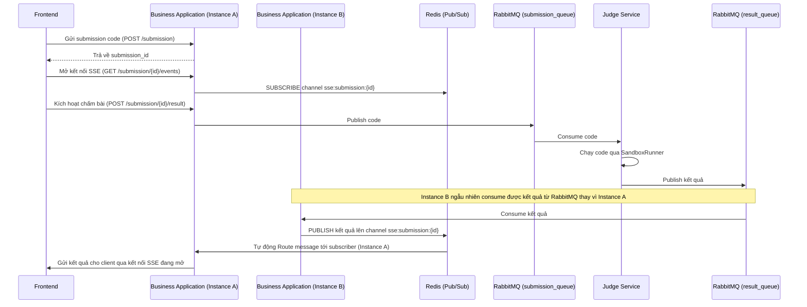

# Luồng hoạt động Online Judge (OJ)

## 1. Tổng quan luồng
Luồng Online Judge xử lý submission theo kiến trúc bất đồng bộ thông qua RabbitMQ. Service Business Application nhận code từ người dùng và đưa vào hàng đợi `submission_queue`. Service Judge lấy code từ hàng đợi để chấm trong môi trường Sandbox, sau đó đẩy kết quả vào `result_queue` để Business Application tiêu thụ và trả về trực tiếp cho client qua Server-Sent Events (SSE).

## 2. Sơ đồ luồng hiện tại (Current)

## 3. Chi tiết các bước (Current)

- **Bước 1: Nhận code từ Frontend**
  - **File:** `src\backend\business-application\src\modules\submission\submission_route.py`
  - **Function:** `create_submission` (tạo submission) và `submission_result` (gửi request chấm bài).
  - **Mô tả:** API nhận dữ liệu từ phía người dùng. Hàm `create_submission` hiện tại trả về dữ liệu mock. Hàm `submission_result` chịu trách nhiệm đóng gói `SubmissionExecutionRequest` để chuẩn bị gửi đi.

- **Bước 2: Đẩy vào hàng đợi xử lý**
  - **Queue:** `submission_queue`
  - **File:** `src\backend\business-application\src\bases\constants\submission_queues.py` (Nơi chứa tên queue).
  - **Mô tả:** Tại hàm `submission_result` (trong file `submission_route.py`), hệ thống dùng `rabbitmq.publish` đẩy request vào `SUBMISSION_EXECUTION_QUEUE`.

- **Bước 3: Judge chấm bài**
  - **File:** `src\backend\judge\src\consumers\submission_execution_consumer.py`
  - **Function:** `process_submission_execution_request`
  - **Mô tả:** Service Judge consume dữ liệu từ queue. Nó tìm language adapter tương ứng, khởi tạo workspace, và chạy code bên trong Docker container thông qua `sandbox_runner.run()`.

- **Bước 4: Trả kết quả về**
  - **Queue:** `result_queue`
  - **Mô tả:** Sau khi có kết quả chạy code, hàm `process_submission_execution_request` (của Judge Service) tạo đối tượng `SubmissionExecutionResult` và publish ngược lại vào RabbitMQ thông qua `SUBMISSION_EXECUTION_RESULT_QUEUE`.

- **Bước 5: Xử lý kết quả trả về và báo cho User**
  - **File:** `src\backend\business-application\src\services\rabbitmq\submission_execution_result_consumer.py`
  - **Function:** `handle_submission_execution_result`
  - **Mô tả:** Business Application consume dữ liệu từ `result_queue`. Tại đây, hệ thống gửi dữ liệu trực tiếp về cho người dùng qua kết nối SSE (`sse_manager.publish`).

## 4. Vấn đề của kiến trúc hiện tại

- **Giới hạn của kiến trúc SSE hiện tại:**
  - `SSEManager` hiện tại sử dụng in-memory dict (`self.clients`) để lưu trữ kết nối theo `submission_id`. 
  - Điều này nghĩa là hệ thống chỉ đang hoạt động đúng khi Business Application chạy ở dạng 1 instance duy nhất. Nếu scale ra nhiều instance mà không có sticky session hoặc không có pub/sub layer (như Redis), client hoàn toàn có thể không nhận được kết quả (do instance xử lý kết quả RabbitMQ khác với instance đang giữ kết nối SSE của client). Cần lưu ý gap này khi chuẩn bị scale hệ thống sau này.

## 5. Đề xuất kiến trúc mới (Proposed - Redis Pub/Sub)

Dưới đây là sơ đồ mở rộng khi áp dụng Redis Pub/Sub làm tầng trung gian để giải quyết bài toán scale ra nhiều instance của Business Application (minh hoạ bằng Instance A và Instance B):

## 6. Các thay đổi cần thực hiện trong code

- Thay vì `SSEManager` lưu kết nối trong in-memory dict (`self.clients`), chuyển sang dùng Redis Pub/Sub làm tầng trung gian giữa các instance:
  1. Khi client mở kết nối SSE, instance đang xử lý sẽ `SUBSCRIBE` vào 1 Redis channel đặt tên theo `submission_id` (VD: `sse:submission:{id}`).
  2. Khi bất kỳ instance nào consume được kết quả từ `result_queue`, thay vì tự tìm trong dict của chính nó, sẽ `PUBLISH` kết quả lên đúng Redis channel đó.
  3. Redis tự động route message tới đúng instance đang subscribe, bất kể instance nào consume được message từ RabbitMQ.
- Cần kiểm tra xem project đã có Redis service trong `docker-compose.yaml` hay chưa, nếu chưa cần bổ sung thêm.
- Lý do chọn Redis Pub/Sub thay vì sticky session: sticky session dễ vỡ khi instance bị restart/crash giữa phiên; polling thì chậm hơn và tốn request. Redis Pub/Sub xử lý đúng bài toán multi-instance mà không đánh đổi độ trễ.

## 7. Các điểm chưa rõ / gap khác

- **Lưu ý về tên queue:**
  - Giá trị chuỗi thật của hằng số `SUBMISSION_EXECUTION_QUEUE` được set là `"submission_queue"` và `SUBMISSION_EXECUTION_RESULT_QUEUE` là `"result_queue"`.
  - Cần lưu ý tên gọi thực tế này (đặc biệt là `"result_queue"`, không phải `"submission_result_queue"` như cách team hay gọi nhầm trước đây) để tránh sai sót khi debug, tra cứu trên RabbitMQ.