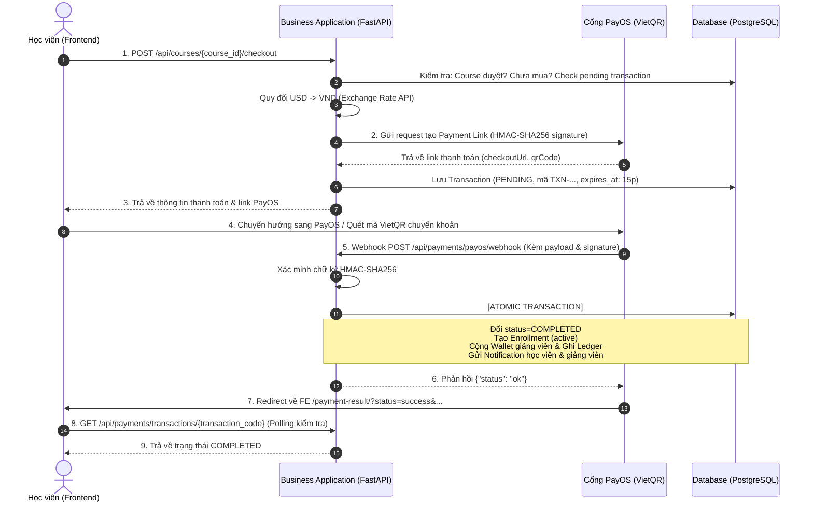

# HƯỚNG DẪN TÍCH HỢP & SỬ DỤNG HỆ THỐNG THANH TOÁN (PAYOS - VIETQR)

Tài liệu này hướng dẫn chi tiết cách cấu hình, sử dụng và kiểm thử hệ thống thanh toán khóa học tự động qua cổng **PayOS (VietQR)** trong LMS Platform (`business-application`).

---

## 📌 1. Tổng Quan Kiến Trúc & Luồng Thanh Toán

Hệ thống hỗ trợ thanh toán học phí bằng mã VietQR chuẩn Napas qua cổng PayOS với các đặc điểm nổi bật:
* **Tự động quy đổi tỷ giá (USD ➔ VND)**: Giá khóa học lưu trong DB theo USD, khi tạo đơn thanh toán hệ thống tự động tra cứu tỷ giá thời gian thực từ `open.er-api.com` (có cache 6 giờ) để tính số tiền VND chính xác.
* **Xác thực bảo mật chữ ký số (HMAC-SHA256)**: Webhook gửi từ PayOS được verify chữ ký theo đúng tiêu chuẩn PayOS để ngăn chặn giả mạo thông tin giao dịch.
* **ACID & Concurrent-Safe Fulfillment**: Khi nhận webhook thanh toán từ PayOS (kể cả trường hợp PayOS retry hoặc gửi webhook đồng thời), hệ thống áp dụng cơ chế Row-Level Locking (`SELECT ... FOR UPDATE`) trên bản ghi `TransactionModel` và `WalletModel` để serialize quá trình fulfillment per `transaction_code`. Cơ chế này đảm bảo tính Idempotency an toàn, ngăn chặn tuyệt đối tình trạng race condition, double-credit số dư ví hoặc nhân đôi bản ghi sổ cái (ledger). Toàn bộ các tác vụ sau diễn ra trong cùng một Transaction Database duy nhất:
  1. Đổi trạng thái giao dịch sang `COMPLETED`.
  2. Kích hoạt khóa học cho học viên (`EnrollmentModel` với `status="active"`).
  3. Cộng số dư ví khả dụng của giảng viên (`WalletModel.available_balance`).
  4. Ghi sổ cái bất biến kế toán (`WalletLedgerModel` với `entry_type="REVENUE"`).
  5. Bắn thông báo (`NotificationModel`) cho cả học viên và giảng viên.

### Sơ đồ tuần tự (Sequence Diagram)



---

## ⚙️ 2. Cấu Hình Biến Môi Trường (.env)

Trong file `src/backend/business-application/.env`, bổ sung các thông số cấu hình sau:

```ini
# PayOS Merchant Credentials (Lấy từ dashboard https://my.payos.vn)
PAYOS_CLIENT_ID=your_client_id_here
PAYOS_API_KEY=your_api_key_here
PAYOS_CHECKSUM_KEY=your_checksum_key_here

# Frontend URL (Dùng để PayOS redirect sau khi thanh toán hoặc hủy)
FE_URL=http://localhost:5173

# Fallback JWT Public Key (Tùy chọn: dùng khi test local không cần mở auth-provider)
# JWT_ACCESS_PUBLIC=-----BEGIN PUBLIC KEY-----...-----END PUBLIC KEY-----
```

---

## 🚀 3. Chi Tiết Danh Sách API Endpoints

Tất cả các API dưới đây đều nằm dưới tiền tố `/api` của `business-application` (mặc định chạy tại port `4000`).

### 3.1. Khởi tạo đơn thanh toán (Checkout)

Học viên bắt đầu quá trình thanh toán một khóa học có phí.

* **Method**: `POST`
* **Path**: `/api/courses/{course_id}/checkout`
* **Header**:
  * `Authorization: Bearer <access_token>` (Bắt buộc)
  * `Idempotency-Key: <uuid>` (Tùy chọn, chống submit đơn trùng lặp)

#### Ví dụ cURL:
```bash
curl -X POST "http://localhost:4000/api/courses/1/checkout" \
  -H "Authorization: Bearer YOUR_ACCESS_TOKEN" \
  -H "Content-Type: application/json"
```

#### Response thành công (`201 Created`):
```json
{
  "transaction_code": "TXN-1725820492123",
  "order_code": 1725820492123,
  "checkout_url": "https://pay.payos.vn/web/a1b2c3d4e5f6...",
  "qrcode": "00020101021238540010A0000007270124...",
  "amount": 28.7,
  "currency": "USD",
  "status": "PENDING",
  "expires_at": "2026-09-09T02:15:00Z",
  "completed_at": null,
  "course_id": 1,
  "student_id": 1
}
```
*Frontend có thể chuyển hướng người dùng sang `checkout_url` hoặc dùng chuỗi `qrcode` để tự render mã VietQR trên giao diện.*

---

### 3.2. Kiểm tra trạng thái giao dịch (Polling)

Frontend gọi định kỳ (polling mỗi 2–3 giây) khi người dùng đang ở trang chờ quét mã QR để cập nhật trạng thái ngay khi học viên thanh toán xong.

* **Method**: `GET`
* **Path**: `/api/payments/transactions/{transaction_code}`
* **Header**: Không yêu cầu (Public)

#### Ví dụ cURL:
```bash
curl -X GET "http://localhost:4000/api/payments/transactions/TXN-1725820492123"
```

#### Response thành công (`200 OK`):
```json
{
  "transaction_code": "TXN-1725820492123",
  "order_code": 1725820492123,
  "course_id": 1,
  "course_slug": "advanced-masterclass-2870",
  "amount": 28,
  "status": "COMPLETED",
  "completed_at": "2026-09-09T01:45:30Z"
}
```

Các giá trị của `status`:
* `PENDING`: Đang chờ thanh toán (chưa quét mã hoặc ngân hàng đang xử lý).
* `COMPLETED`: Đã thanh toán thành công, khóa học đã được kích hoạt.
* `FAILED`: Đã hủy hoặc hết hạn thời gian thanh toán.

---

### 3.3. Hủy giao dịch thanh toán

Người dùng nhấn nút "Hủy đơn" trên giao diện LMS hoặc muốn tạo lại đơn mới.

* **Method**: `POST`
* **Path**: `/api/payments/transactions/{transaction_code}/cancel`
* **Header**:
  * `Authorization: Bearer <access_token>` (Bắt buộc, chính chủ của giao dịch)

#### Ví dụ cURL:
```bash
curl -X POST "http://localhost:4000/api/payments/transactions/TXN-1725820492123/cancel" \
  -H "Authorization: Bearer YOUR_ACCESS_TOKEN"
```

#### Response thành công (`200 OK`):
```json
{
  "transaction_code": "TXN-1725820492123",
  "status": "FAILED",
  "message": "Đã hủy giao dịch thanh toán"
}
```

---

### 3.4. Webhook nhận kết quả từ PayOS

Đây là endpoint công khai để hệ thống PayOS tự động gọi sang sau khi người dùng chuyển khoản thành công.

* **Method**: `POST`
* **Path**: `/api/payments/payos/webhook`
* **Header**: Không yêu cầu xác thực JWT (Xác thực qua chữ ký số `signature`)

#### Cấu trúc Payload từ PayOS:
```json
{
  "code": "00",
  "desc": "success",
  "data": {
    "orderCode": 1725820492123,
    "amount": 717500,
    "description": "LMS 1725820492123",
    "accountNumber": "123456789",
    "reference": "FT240909123456",
    "transactionDateTime": "2026-09-09 01:45:00",
    "currency": "VND",
    "paymentLinkId": "a1b2c3d4e5f6",
    "code": "00",
    "desc": "Thanh toan thanh cong"
  },
  "signature": "c9284f2910ab38c4193d..."
}
```

---

### 3.5. Danh sách giao dịch & Ghi danh (Dành cho Admin - Yêu cầu Role ADMIN)

* **Danh sách tất cả giao dịch**:
  * `GET /api/admin/payments?page=1&size=20&status=COMPLETED`
  * Header: `Authorization: Bearer <token_admin>` (Yêu cầu Role `ADMIN`)
  * Hỗ trợ lọc theo `status`: `PENDING`, `COMPLETED`, `FAILED`.
* **Danh sách tất cả lượt đăng ký khóa học**:
  * `GET /api/admin/enrollments?page=1&size=20`
  * Header: `Authorization: Bearer <token_admin>` (Yêu cầu Role `ADMIN`)

---

## 🧪 4. Hướng Dẫn Kiểm Thử Luồng Thanh Toán (Step-by-Step)

### Bước 1: Khởi động hệ thống
1. Đảm bảo Database PostgreSQL đã chạy và migrate đủ bảng.
2. Khởi động `auth-provider` (port 4001) và `business-application` (port 4000).

### Bước 2: Tạo đơn thanh toán
Gửi request checkout một khóa học:
```bash
curl -X POST "http://localhost:4000/api/courses/1/checkout" \
  -H "Authorization: Bearer <TOKEN_STUDENT>"
```
Lấy giá trị `checkout_url` từ kết quả trả về, dán vào trình duyệt để mở giao diện cổng thanh toán PayOS.

### Bước 3: Giả lập thanh toán Webhook trên môi trường Test / Local
Khi chạy local chưa có IP public để PayOS gọi Webhook trực tiếp:
* **Cách 1 (Khuyên dùng)**: Dùng công cụ tunnel như [ngrok](https://ngrok.com/) hoặc [localtunnel](https://localtunnel.me/) để tạo public URL:
  ```bash
  ngrok http 4000
  ```
  Lấy URL ngrok (ví dụ `https://abc-123.ngrok-free.app`) cấu hình vào mục Webhook URL trên Dashboard PayOS:
  `https://abc-123.ngrok-free.app/api/payments/payos/webhook`

* **Cách 2**: Chuyển khoản thật với số tiền nhỏ (2.000 VNĐ) trên kênh PayOS Sandbox. Hệ thống sandbox sẽ tự động kích hoạt webhook.

### Bước 4: Xác minh kết quả sau thanh toán
1. Gọi API kiểm tra trạng thái:
   ```bash
   curl "http://localhost:4000/api/payments/transactions/TXN-<ORDER_CODE>"
   ```
   Kết quả trả về `status: "COMPLETED"`.
2. Kiểm tra quyền truy cập khóa học của học viên: Học viên gọi `GET /api/courses/{course_id}` hoặc xem danh sách khóa học của tôi, cờ `is_enrolled` sẽ bằng `true`.
3. Kiểm tra ví giảng viên: Số dư ví đã được cộng đúng giá tiền USD của khóa học.

---

## ⚠️ 5. Bảng Mã Lỗi Thường Gặp & Cách Khắc Phục

| Mã lỗi HTTP | Error Code | Nguyên nhân | Hướng xử lý |
| :--- | :--- | :--- | :--- |
| `404 Not Found` | `NOT_FOUND` | Không tìm thấy `course_id` hoặc khóa học đã bị xóa mềm. | Kiểm tra lại ID khóa học trong Database. |
| `400 Bad Request` | `INVALID_STATE` | Khóa học có `status` là `DRAFT` hoặc `PENDING_REVIEW` (chưa được duyệt). | Duyệt khóa học sang trạng thái `APPROVED` trước khi mở bán. |
| `400 Bad Request` | `INVALID_REQUEST` | Khóa học có `price = 0` (miễn phí). | Với khóa học miễn phí, học viên gọi API enroll trực tiếp, không qua cổng checkout. |
| `400 Bad Request` | `INVALID_REQUEST` | Chữ ký `signature` webhook không trùng khớp với checksum key. | Kiểm tra xem `PAYOS_CHECKSUM_KEY` trong `.env` có khớp với Dashboard PayOS không. |
| `403 Forbidden` | `FORBIDDEN` | Giảng viên sở hữu khóa học tự mua khóa học của chính mình. | Đăng nhập bằng tài khoản học viên khác để mua. |
| `409 Conflict` | `DUPLICATE_RESOURCE`| Học viên đã đăng ký/sở hữu khóa học này từ trước. | Chuyển học viên sang chế độ học tập (Study Mode). |
| `502 Bad Gateway` | `None` | Không kết nối được tới PayOS hoặc PayOS trả mã lỗi khởi tạo link. | Kiểm tra kết nối mạng và tính chính xác của `PAYOS_CLIENT_ID` / `PAYOS_API_KEY`. |
