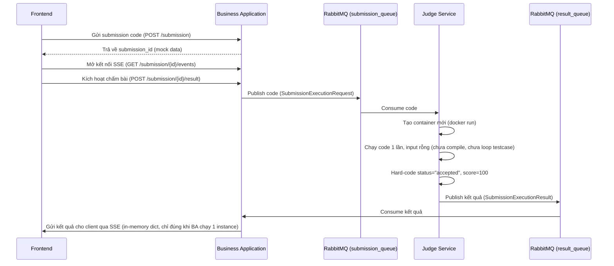
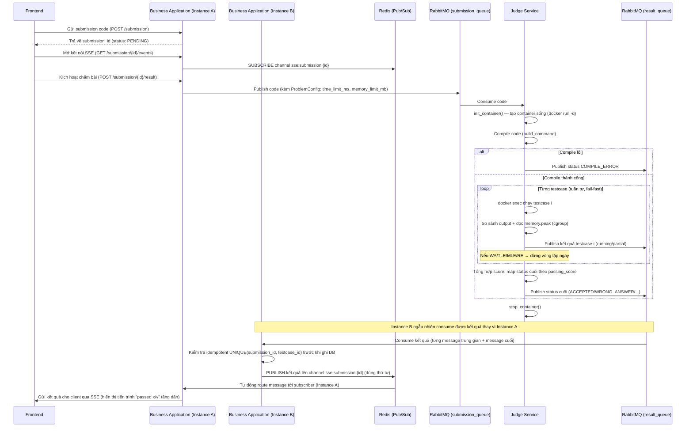

# Nghiên cứu tối ưu Judge-Worker cho LMS Coding Platform

> Tài liệu tổng hợp phân tích hiện trạng, các gap so với `api_spec.md`/`DATABASE.txt`, so sánh phương án kỹ thuật, chi phí công cụ, và đề xuất thiết kế cuối cùng cho service `judge`.

---

## 1. Hiện trạng service `judge`

## Đã có

- **Cơ chế hàng đợi (RabbitMQ) giữa 2 service:**
  Khi người dùng nộp bài, service `business-application` (nơi xử lý nghiệp vụ chính) không tự chạy code — nó chỉ **bỏ code vào một "hàng đợi" tên là `submission_queue`**, giống như bỏ phiếu yêu cầu vào hộp thư.
  Service `judge` (chuyên chấm bài) liên tục "lấy phiếu" từ hộp thư đó ra để xử lý.
  Sau khi chấm xong, `judge` **bỏ kết quả vào một hộp thư khác** tên `result_queue`, để `business-application` lấy ra và trả về cho người dùng.
  → Cách làm này giúp 2 service không cần "gọi trực tiếp" nhau, chạy độc lập, và nếu `judge` đang bận thì bài nộp vẫn được xếp hàng chờ chứ không bị mất.

- **Chạy code trong "hộp cách ly" (Docker container) an toàn:**
  Code của người dùng không được chạy trực tiếp trên máy chủ, mà chạy trong một **container Docker** — có thể hình dung như một "căn phòng kín" tạm thời, dùng xong thì hủy luôn. Trong phòng đó có sẵn các khóa an toàn:
  - `--memory`, `--cpus`: giới hạn RAM và CPU được dùng, tránh code chạy vô hạn/tràn bộ nhớ làm sập máy chủ.
  - `--pids-limit`: giới hạn số tiến trình được tạo ra, tránh code cố tình tạo hàng ngàn tiến trình để phá hệ thống.
  - `--cap-drop ALL`, `--security-opt no-new-privileges`: tước hết các "quyền đặc biệt" của container, không cho nó leo thang quyền hạn.
  - `--user 1000:1000`: chạy bằng tài khoản thường, không phải quyền quản trị (root).
  - `--read-only`: ổ đĩa trong container chỉ được đọc, không được ghi/sửa file hệ thống.
  - `--network none`: cắt hoàn toàn kết nối mạng, code không thể gọi ra ngoài internet.
  → Tóm lại: dù code người dùng có ý đồ xấu (vô hạn vòng lặp, cố truy cập file lạ, cố kết nối mạng...) thì cũng bị chặn trong "căn phòng kín" này, không ảnh hưởng tới máy chủ thật.

- **Kiến trúc dễ mở rộng thêm ngôn ngữ mới (Language Adapter):**
  Hệ thống tách riêng phần "biết cách chạy ngôn ngữ nào" ra thành từng khối riêng biệt: một khối cho Python (`PythonLanguageAdapter`), một khối cho C++ (`CppLanguageAdapter`), và có một khuôn mẫu chung (`LanguageAdapter`) quy định mỗi khối phải có gì (tên file, lệnh build, lệnh chạy...).
  → Nhờ vậy, sau này muốn thêm ngôn ngữ mới (VD: Java, JavaScript) chỉ cần viết thêm 1 khối mới theo đúng khuôn mẫu, không cần sửa lại phần lõi xử lý.

- **Trả kết quả về ngay lập tức, không cần bấm F5 (SSE):**
  Thay vì người dùng phải liên tục bấm nút để kiểm tra "chấm xong chưa", hệ thống dùng công nghệ **SSE (Server-Sent Events)** — hiểu đơn giản là mở một "đường ống" giữ kết nối liên tục giữa trình duyệt và server. Khi nào `judge` chấm xong, kết quả sẽ tự động "chảy" qua đường ống đó về thẳng màn hình người dùng, giống như xem trực tiếp chứ không cần refresh trang.
  → Điều này khớp với màn hình chấm bài đã thiết kế (`OJ02OnlineJudgeWorkspace.md`), nơi khung Console hiển thị "Ready → Running → kết quả" theo thời gian thực.

### Các gap so với `api_spec.md` và `DATABASE.txt`

| # | Vấn đề | Chi tiết |
|---|---|---|
| 1 | Không có multi-testcase | `SandboxRunner.run()` chỉ chạy 1 lần với `stdin_data=""` cố định. Schema có bảng `testcase` (nhiều testcase/problem, `is_hidden`, `score` riêng) và `submission_result_detail` (kết quả theo từng testcase, `UNIQUE(submission_id, testcase_id)`). |
| 2 | Không phân biệt Run và Submit | Spec có `/problems/{slug}/run` (transient, không lưu DB, dùng custom input) và `/problems/{slug}/submit` (tạo `submission`, chấm full testcase, `status: PENDING`). Code hiện tại gộp chung mock. |
| 3 | Chưa compile trước khi run | `CppLanguageAdapter.build_command()` tồn tại nhưng không được gọi trong `submission_execution_consumer.py` → C++ sẽ lỗi vì chưa compile. Thiếu trạng thái `COMPILE_ERROR`. |
| 4 | Status hard-code | Code set cứng `status="accepted", score=100`. Enum chuẩn theo spec: `PENDING, RUNNING, ACCEPTED, WRONG_ANSWER, TIME_LIMIT_EXCEEDED, MEMORY_LIMIT_EXCEEDED, RUNTIME_ERROR, COMPILE_ERROR`. |
| 5 | Chưa đo memory | `SandboxResult` chỉ có `runtime_ms`, không có `memory_kb` dù cột này có trong `submission` và `submission_result_detail`. |
| 6 | Chưa idempotent | Invariant trong spec: *"Duplicate worker result không tạo detail/progress/activity trùng"*. RabbitMQ `ack/nack` có thể redeliver message; `submission_execution_result_consumer.py` hiện chưa check trùng trước khi ghi DB. |
| 7 | Config hard-code | `ProblemConfigView` quy định `time_limit_ms`/`memory_limit_mb` theo từng `problem_id` + `language_id`, nhưng `submission_route.py` đang hard-code `time_limit_ms=1000, memory_limit_mb='128mb'`. |
| 8 | Testcase là file, chưa dùng | `input_file`/`output_file` là object storage key, nhưng `stdin_data` hiện đang truyền chuỗi rỗng, chưa có bước tải và so sánh output. |

---

## 2. Ba hướng nghiên cứu chính (ưu tiên theo mức độ gap)

### 2.1. Multi-testcase judging engine (trọng tâm nhất)
- Loop qua danh sách testcase (public + hidden) thay vì chạy 1 lần cố định.
- Cách so sánh output của MVP: so khớp tuyệt đối theo byte UTF-8, bao gồm whitespace và newline cuối; không có trim whitespace hoặc special judge.
- Chỉ map sang `ACCEPTED` khi toàn bộ testcase pass. Kết quả từng testcase trước đó là progress/partial result, không phải accepted.
- Compile riêng một bước, trả `COMPILE_ERROR` nếu build thất bại, trước khi chạy bất kỳ testcase nào.

### 2.2. Reliability & idempotency của hàng đợi
- Dùng `UNIQUE(submission_id, testcase_id)` sẵn có trong schema để chặn insert trùng khi message bị redeliver.
- Dead-letter queue cho job lỗi liên tục, tránh vòng lặp `nack` vô hạn.
- Đảm bảo đúng 1 lần cập nhật completion/progress khi `ACCEPTED` đạt `passing_score`.

### 2.3. Resource limit & đo lường chính xác
- Đo memory usage thực tế của container (thay vì bỏ trống như hiện tại).
- Phân biệt `TIME_LIMIT_EXCEEDED` và `MEMORY_LIMIT_EXCEEDED` thay vì gộp chung `timed_out`.
- Load `time_limit_ms`/`memory_limit_mb` theo `ProblemConfig` (per-language) thay vì hard-code.

---

## 3. So sánh phương án kỹ thuật

### 3.1. Chiến lược container

| Phương án | Cách hoạt động | Cô lập | Hiệu năng | Độ phức tạp | Phù hợp quy mô |
|---|---|---|---|---|---|
| 1 container / testcase | Mỗi testcase spawn container Docker mới, chạy xong xóa | Rất cao | Chậm nhất — overhead khởi tạo (~100-300ms) × số testcase | Thấp | Ít testcase (<10), traffic thấp |
| **1 container / submission** (compile 1 lần, `docker exec` nhiều lần) | Compile 1 lần trong container, exec nhiều lần với input khác nhau, không tạo container mới | Khá — mỗi lần exec là process riêng, timeout/ulimit riêng | Nhanh hơn đáng kể — chỉ tốn overhead container 1 lần/submission | Trung bình | **Phù hợp đồ án LMS hiện tại** |
| Container pool / warm pool | Giữ sẵn N container idle theo ngôn ngữ, worker lấy dùng rồi trả lại | Cần reset kỹ giữa các lần dùng | Nhanh nhất — loại bỏ cold-start | Cao | Traffic cao kiểu Judge0/HackerRank — vượt nhu cầu đồ án |

**→ Đề xuất:** "1 container / submission" — sửa `SandboxRunner` để tách `init_container()` (chạy `docker run -d ... tail -f /dev/null` giữ container sống), dùng `docker exec` nhiều lần cho từng testcase, cuối cùng mới `stop_container()`.

### 3.2. Thứ tự chạy testcase & scale hệ thống

| Phương án | Mô tả | Ưu điểm | Nhược điểm |
|---|---|---|---|
| **Tuần tự + fail-fast** | Chạy từng testcase theo thứ tự, publish kết quả ngay sau testcase đã chạy, dừng ngay khi gặp WA/TLE/RE đầu tiên (cho luồng Submit) | Tiết kiệm tài nguyên; đơn giản, không lo race condition; phù hợp stream SSE từng testcase | Không trả kết quả cho testcase chưa chạy |
| Song song trong cùng container (nhiều `docker exec` đồng thời) | Chạy nhiều testcase cùng lúc | Nhanh hơn khi nhiều testcase (>10) | CPU/memory limit dùng chung nên `runtime_ms` đo không chính xác; không dừng sớm được; khó tổng hợp kết quả đúng thứ tự |
| **Nhiều worker song song, tuần tự trong 1 submission** | Testcase chạy tuần tự (đo chính xác), tăng thông lượng bằng cách chạy nhiều instance judge service, mỗi instance xử lý 1 submission | Scale đúng cách với RabbitMQ (nhiều consumer cùng nghe 1 queue); đo lường chính xác vì mỗi submission độc lập | Cần giới hạn tổng số container đồng thời theo tài nguyên host |

**→ Đề xuất kết hợp:** "Tuần tự + fail-fast" bên trong 1 submission, cộng với "nhiều worker song song" ở tầng hệ thống (tăng `prefetch_count` + chạy nhiều instance `judge`). Đây là mô hình các OJ thật (Codeforces, Judge0) sử dụng.

### 3.3. Đo memory chính xác

| Phương án | Cách hoạt động | Đánh giá |
|---|---|---|
| `docker stats` polling | Theo dõi định kỳ (vd mỗi 50ms) trong lúc container chạy | Đơn giản, quen thuộc, nhưng có thể bỏ lỡ đỉnh memory thật nếu chương trình cấp phát/giải phóng nhanh; tốn thêm 1 task theo dõi song song |
| **Đọc `memory.peak` (cgroup v2)** / `memory.max_usage_in_bytes` (cgroup v1) sau khi process kết thúc | Đọc file cgroup 1 lần sau khi container dừng | **Chính xác tuyệt đối** vì kernel tự track đỉnh sử dụng; không cần polling, ít tốn tài nguyên hơn |

**→ Đề xuất:** dùng cgroup trực tiếp thay vì polling `docker stats`.

---

## 4. Chi phí công cụ (đã kiểm tra)

| Công cụ | Vai trò trong hệ thống | Giấy phép / Chi phí |
|---|---|---|
| **Docker Engine** (Linux, dùng để deploy server) | Chạy sandbox container | Mã nguồn mở, **miễn phí hoàn toàn**, không giới hạn theo quy mô tổ chức khi dùng trên Linux server (không qua Docker Desktop). |
| **Docker Desktop** (Windows, dùng khi dev local) | Môi trường phát triển local trên máy Windows | **Miễn phí** cho cá nhân, học tập/sinh viên, và tổ chức phi lợi nhuận theo Docker Personal license. Chỉ tổ chức thương mại từ 250 nhân viên hoặc doanh thu trên 10 triệu USD/năm mới cần trả phí (Pro/Team/Business, ~$9–24/user/tháng). Đồ án sinh viên/học thuật không phát sinh phí. |
| **RabbitMQ** | Message queue giữa `business-application` và `judge` | Mã nguồn mở (Mozilla Public License 2.0), **miễn phí**, tự host không giới hạn. |
| **cgroups (v1/v2)** | Đo memory chính xác, giới hạn tài nguyên container | Tính năng có sẵn trong Linux kernel, **miễn phí**, không cần cài thêm phần mềm bên thứ ba. |
| **aio-pika** | Thư viện Python client cho RabbitMQ | Mã nguồn mở, **miễn phí**. |

**Kết luận:** toàn bộ công cụ đề xuất trong tài liệu này đều miễn phí ở quy mô đồ án học thuật/sinh viên, không phát sinh chi phí license nào. Điểm cần lưu ý duy nhất: nếu sau này đồ án phát triển thành sản phẩm thương mại có quy mô lớn (>250 nhân viên hoặc doanh thu >10 triệu USD/năm), Docker Desktop trên máy dev Windows/macOS sẽ cần license trả phí — nhưng Docker Engine trên server Linux triển khai thật thì vẫn miễn phí trong mọi trường hợp.

---

## 5. Thiết kế đề xuất tổng thể (so với luồng hiện tại)

| Khía cạnh | Hiện tại | Sau tối ưu |
|---|---|---|
| Container | Tạo mới mỗi lần gọi `run()`, chưa có multi-testcase | Tạo 1 lần/submission, `docker exec` nhiều lần |
| Compile | Không gọi `build_command()` — C++ sẽ lỗi | Compile 1 lần, cache trong workspace, chạy nhiều testcase trên cùng binary |
| Testcase | Không có, chạy input rỗng | Loop tuần tự, so khớp output tuyệt đối theo byte UTF-8, publish từng kết quả và dừng sớm khi sai (Submit) / chạy custom input riêng cho Run |
| Memory | Không đo | Đọc cgroup `memory.peak` sau mỗi lần exec |
| Scale hệ thống | 1 process consumer duy nhất | Tăng `prefetch_count` hợp lý + chạy nhiều instance judge service, giới hạn tổng container đồng thời theo tài nguyên host |
| Idempotency | Chưa có | Check `UNIQUE(submission_id, testcase_id)` trước khi insert `submission_result_detail` |
| Chi phí công cụ | — | Không phát sinh chi phí ở quy mô đồ án (xem mục 4) |

---

## 6. Liên kết với luồng Redis Pub/Sub (đang triển khai — theo `oj-flow.md` mục 5)

Team hiện đang triển khai kiến trúc "Proposed" trong `oj-flow.md` mục 5: dùng Redis Pub/Sub làm tầng trung gian để SSE route đúng client khi Business Application chạy nhiều instance (mỗi instance `SUBSCRIBE` một channel `sse:submission:{id}`; instance nào consume được kết quả từ `result_queue` thì `PUBLISH` lên đúng channel đó).

Kiến trúc này **là điều kiện tiên quyết** để áp dụng đề xuất "nhiều worker song song" ở mục 3.2 — nếu Business Application scale nhiều instance mà không có Redis Pub/Sub, client sẽ không nhận được kết quả khi instance xử lý RabbitMQ khác với instance giữ kết nối SSE (đúng gap được nêu trong `oj-flow.md` mục 4). Vì vậy hai phần thiết kế này nên được xem là một cặp bổ trợ nhau, không tách rời.

Hai điểm cần lưu ý khi kết hợp:

- **Thứ tự message khi có fail-fast:** với thiết kế "tuần tự + fail-fast" ở mục 3.2, Judge sẽ publish nhiều message trung gian vào `result_queue` (`RUNNING` → từng testcase đã chạy → status cuối) thay vì chỉ 1 message cuối như luồng hiện tại. Mỗi message có `sequence` tăng dần. Business Application phải forward đúng thứ tự các message này lên Redis channel; testcase chưa chạy sau lỗi không có event. Chỉ khi toàn bộ testcase pass mới có status cuối `ACCEPTED`.
- **Vị trí đặt idempotency check:** check `UNIQUE(submission_id, testcase_id)` (mục 2.2 và mục 5) phải thực hiện **trước** bước `PUBLISH` lên Redis, không phải sau. Nếu không, một message bị RabbitMQ redeliver có thể khiến Redis channel nhận trùng dữ liệu, khiến FE nhận state nhảy lùi hoặc hiển thị sai trạng thái.

## 7. Bước tiếp theo (chưa triển khai, cần quyết định)

- [ ] Viết lại `SandboxRunner`: tách `init_container()` (container sống) khỏi logic exec, thêm phương thức đọc `memory.peak` từ cgroup.
- [ ] Viết lại `submission_execution_consumer.py`: thêm bước compile, loop testcase tuần tự với fail-fast, map kết quả sang enum status chuẩn.
- [ ] Thêm cơ chế idempotent tại `submission_execution_result_consumer.py` trước khi ghi `submission_result_detail`.
- [ ] Load `ProblemConfig` theo `problem_id` + `language_id` thay vì hard-code `time_limit_ms`/`memory_limit_mb`.
- [ ] Xác nhận Business Application forward đúng thứ tự các message trung gian (running → từng testcase → status cuối) lên Redis channel `sse:submission:{id}`, đặt idempotency check trước bước publish.

# SƠ ĐỒ 1: LUỒNG HIỆN TẠI

# SƠ ĐỒ 2: LUỒNG ĐỀ XUẤT (Proposed)
Kết hợp: multi-testcase + fail-fast + idempotency + Redis Pub/Sub

## Tóm tắt thay đổi trong luồng mới

So với luồng hiện tại, luồng đề xuất thay đổi 4 điểm chính: 
(1) Judge chạy **compile riêng** trước khi thực thi và **lặp qua nhiều testcase tuần tự có fail-fast** thay vì chạy 1 lần với input rỗng; 
(2) mỗi lần chạy đo thêm **memory thực tế qua cgroup**, kết quả trả về đúng theo enum trạng thái chuẩn (ACCEPTED, WRONG_ANSWER, TLE, MLE, COMPILE_ERROR...) thay vì hard-code "accepted"; 
(3) Business Application **kiểm tra idempotent** trước khi ghi kết quả, tránh trùng dữ liệu khi RabbitMQ redeliver message; 
(4) SSE được route qua **Redis Pub/Sub** thay vì lưu trong bộ nhớ instance, nhờ đó Business Application scale được nhiều instance mà client vẫn nhận đúng kết quả của mình.
