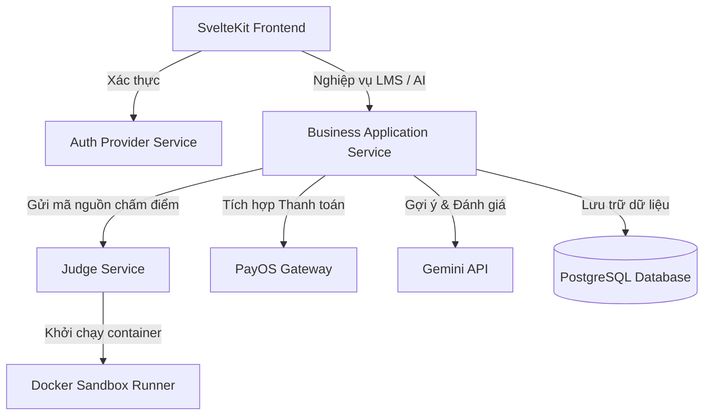
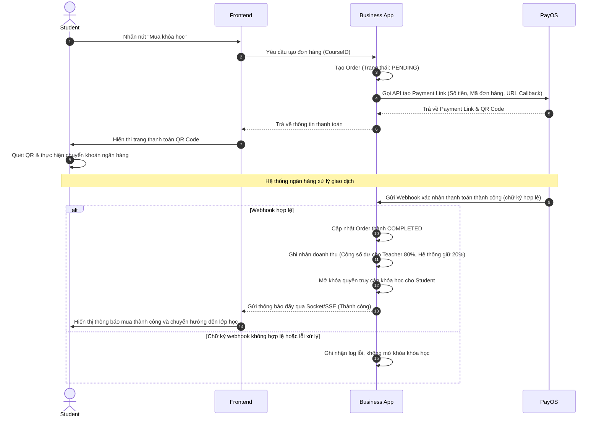
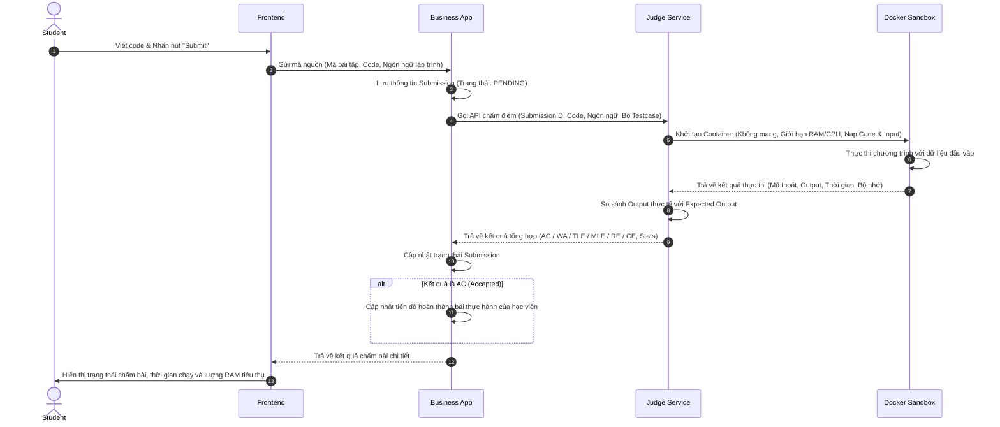
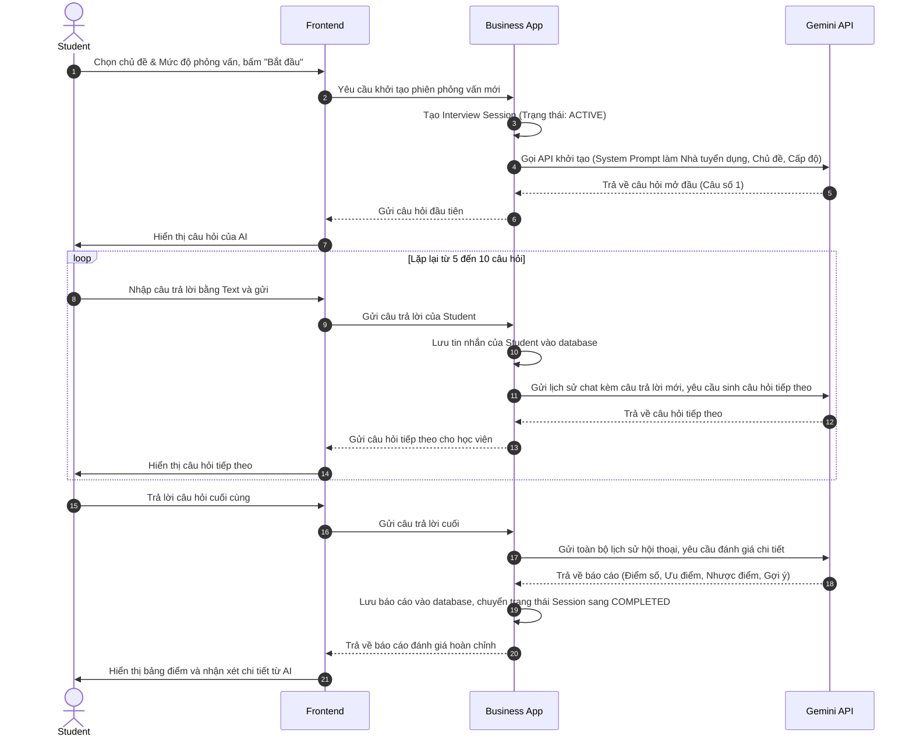

# Tài liệu Đặc tả Yêu cầu Sản phẩm (PRD) Chi tiết - LMS CODING PLATFORM 

Tài liệu này cung cấp một mô tả chi tiết, rõ ràng và đầy đủ về cấu trúc, tính năng, luồng nghiệp vụ cũng như các yêu cầu kỹ thuật của hệ thống LMS Coding Platform mang tên **SkillBoost**. Tài liệu phục vụ cho đội ngũ lập trình viên, thiết kế hệ thống và bộ phận vận hành để triển khai dự án một cách đồng nhất.

---

## 1. Giới thiệu tổng quan & Bối cảnh dự án
**SkillBoost** là một nền tảng quản lý học tập (LMS) hướng tới đối tượng người học lập trình, kết hợp giữa:
1. **LMS truyền thống:** Xem bài giảng lý thuyết (hỗ trợ văn bản lý thuyết Markdown, đính kèm hình ảnh và video bài giảng) và làm các bài thi trắc nghiệm (Quiz).
2. **Online Judge (Leetcode-like):** Thực hành giải bài tập coding trực tuyến, biên dịch và chạy code tự động trên môi trường cô lập, trả về kết quả chấm điểm thời gian thực.
3. **AI Interview:** Giả lập các buổi phỏng vấn thử (Mock Interview) dưới dạng text-based chat với AI đóng vai trò nhà tuyển dụng, nhận phản hồi, chấm điểm và gợi ý cải thiện kỹ năng.
4. **Hệ thống thương mại hóa:** Cho phép Giảng viên thiết lập giá bán khóa học, thanh toán trực tiếp qua QR Pay ngân hàng (PayOS) và đối soát doanh thu.

---

## 2. Mục tiêu dự án
- **Đối với Học viên:** Cung cấp giải pháp "All-in-one" từ học lý thuyết, xem video bài giảng trực quan, thực hành viết code thực tế cho tới luyện phỏng vấn xin việc.
- **Đối với Giảng viên:** Cung cấp công cụ xây dựng học liệu đa dạng, Dashboard theo dõi trực quan hiệu quả giảng dạy/doanh thu và cơ chế kiếm tiền minh bạch.
- **Đối với Hệ thống:** Đảm bảo khả năng chịu tải tốt, chấm bài nhanh, an toàn tuyệt đối trước các đoạn mã độc do người dùng nộp lên.

---

## 3. Kiến trúc Hệ thống & Luồng dữ liệu (High-Level Architecture)

Hệ thống sử dụng cơ sở dữ liệu chính là **PostgreSQL**, Frontend được xây dựng bằng **Svelte** (SvelteKit) và Backend chính sử dụng **FastAPI** kết hợp kiến trúc Microservices gồm 4 khối thành phần chính:

### Chi tiết các Service:
1. **Frontend (SvelteKit & TailwindCSS v4):** Giao diện Single Page Application (SPA) tương tác cao, tích hợp Code Editor (Monaco Editor hoặc CodeMirror) hỗ trợ viết code và giao diện chat phỏng vấn AI.
2. **Auth Provider Service (FastAPI / Auth Server):** Chịu trách nhiệm đăng ký, đăng nhập, phát hành JWT token kèm phân quyền người dùng. Cung cấp JWK (JSON Web Key) công khai để các dịch vụ khác xác thực token độc lập.
3. **Business Application Service (FastAPI):** Lõi xử lý nghiệp vụ của toàn bộ hệ thống (khóa học, chương, bài đọc, video bài giảng, quiz, thống kê doanh thu, giao dịch, tích hợp Gemini API cho AI Interview, tương tác bình luận).
4. **Judge Service (FastAPI & Docker SDK / RapidAPI Judge0):** Dịch vụ chấm code tự động. Nhận mã nguồn từ Business App, khởi chạy container Docker cô lập hoặc điều phối thông qua các giải pháp sandbox (như Judge0 API tùy thuộc vào cấu hình), truyền dữ liệu testcase, theo dõi tài nguyên tiêu thụ, thu hồi kết quả và trả về cho Business App.

---

## 4. Phân quyền và Vai trò Người dùng (User Roles)

Hệ thống quản lý phân quyền chặt chẽ bằng Role-Based Access Control (RBAC):

### 4.1. Student (Học viên)
- Đăng ký tài khoản mới bằng Email/Mật khẩu hoặc liên kết tài khoản Google.
- Xem danh sách khóa học, tìm kiếm theo tên khóa học hoặc bộ lọc (Miễn phí, Trả phí).
- Xem chi tiết khóa học: Xem thử các bài học được phép, xem lộ trình học và thông tin giảng viên.
- Đăng ký khóa học miễn phí, thanh toán khóa học trả phí qua PayOS.
- Học các bài đọc (Reading), xem video đính kèm bài giảng, làm các bài thực hành đi kèm dưới dạng trắc nghiệm (Quiz) hoặc bài tập lập trình (Coding Problems).
- Luyện phỏng vấn với AI (AI Interview): Chat turn-based, xem lịch sử phỏng vấn, nhận đánh giá chi tiết.
- Gửi báo cáo vi phạm (khóa học có nội dung xấu, giảng viên spam) hoặc khiếu nại giao dịch lỗi.
- Điền form đăng ký trở thành Giảng viên (Become Teacher) và tải lên giấy tờ xác minh (CCCD).

### 4.2. Teacher (Giảng viên)
- Có đầy đủ các quyền của Student.
- Tạo và quản lý hồ sơ giảng viên (Bio, mạng xã hội, thông tin ngân hàng thụ hưởng).
- **Teacher Dashboard:** Theo dõi các chỉ số vận hành và tài chính của giảng viên:
  - **Thống kê Tài chính:** Tổng doanh thu, số dư hiện tại, lịch sử giao dịch mua khóa học của học viên.
  - **Thống kê Học viên:** Tổng số học viên đăng ký các khóa học, danh sách học viên chi tiết, tiến độ hoàn thành các bài học của từng người.
  - **Thống kê Khóa học:** Số lượng đăng ký mới dưới dạng biểu đồ theo thời gian, điểm đánh giá trung bình và các bình luận mới chưa phản hồi.
- Soạn thảo khóa học: Tạo mới, cập nhật mô tả, tải ảnh bìa, đặt giá bán hoặc cấu hình miễn phí.
- Soạn thảo chương học (Chapters) và bài học (Lessons):
  - Biên soạn nội dung bài giảng gồm: Văn bản lý thuyết (Markdown), hình ảnh minh họa (optional) và video bài giảng đính kèm (optional).
  - Thiết kế và gắn **nhiều bài thực hành** (Exercises) cho từng bài học. Mỗi bài thực hành có thể cấu hình ở dạng trắc nghiệm (Quiz) hoặc bài tập coding (Problem) lấy từ ngân hàng đề.
- Quản lý kho bài tập lập trình (Coding Problems) và đề trắc nghiệm (Quizzes):
  - Tạo câu hỏi trắc nghiệm, các lựa chọn đáp án và đáp án đúng.
  - Tạo mô tả bài tập lập trình (đề bài, định dạng input/output, ví dụ mẫu).
  - Tải lên bộ testcase dưới định dạng file ZIP hoặc upload từng cặp file `.in/.inp` và `.out`.
  - Thiết lập giới hạn thời gian chạy (ms) và bộ nhớ giới hạn (MB).
  - Cấu hình bài tập lập trình ở trạng thái Public hoặc Private (chỉ hiển thị trong khóa học liên kết).
- Quản lý bình luận: Xem bình luận của học viên dưới mỗi bài học và trả lời bình luận.
- Quản lý tài chính: Xem tổng doanh thu và lịch sử giao dịch mua khóa học của học viên.

### 4.3. Admin (Quản trị viên)
- Quản lý người dùng: Tìm kiếm tài khoản, vô hiệu hóa (ban) tài khoản vi phạm chính sách, xác thực tài khoản.
- Phê duyệt yêu cầu làm Teacher: Xem hồ sơ yêu cầu, **đối chiếu và xác minh thông tin giấy tờ tùy thân (CCCD)** với dữ liệu người dùng nhập vào để duyệt hoặc từ chối đơn.
- Kiểm duyệt khóa học: Xem nội dung các khóa học do Teacher gửi phê duyệt (bài giảng, video, bài tập thực hành đi kèm), kiểm tra chất lượng và chuyển trạng thái thành Công khai (Active) hoặc Từ chối (Rejected) kèm lý do.
- Quản lý khiếu nại & báo cáo vi phạm: Nhận báo cáo từ Student về khóa học vi phạm bản quyền hoặc nội dung không lành mạnh, ra quyết định ẩn/xóa khóa học.
- Quản lý giao dịch: Tra cứu danh sách giao dịch nạp tiền mua khóa học, cập nhật thủ công trạng thái giao dịch nếu có sự cố webhook từ PayOS.

---

## 5. Đặc tả luồng nghiệp vụ cốt lõi (Key Workflows)

### 5.1. Luồng Mua khóa học qua cổng PayOS

### 5.2. Luồng Chấm bài trực tuyến (Online Judge)

### 5.3. Luồng phỏng vấn giả lập với AI (AI Interview)

---

## 6. Mô hình Cơ sở Dữ liệu khái niệm (Conceptual Database Schema)

Hệ thống cơ sở dữ liệu (PostgreSQL) sẽ bao gồm các bảng dữ liệu chính sau để làm rõ cấu trúc liên kết thực thể:

### 6.1. Enums (Các kiểu dữ liệu liệt kê)
- `AccountStatus`: `BANNED`, `UNVERIFIED`, `ACTIVE`
- `TeacherRegisterStatus`: `AGREE`, `REJECT`, `PENDING`
- `CourseStatus`: `DRAFT`, `PENDING_REVIEW`, `PUBLISHED`, `ARCHIVED`
- `LessonContentType`: `READING`, `QUIZ`, `PROBLEM`
- `ProblemDifficulty`: `EASY`, `MEDIUM`, `HARD`
- `Role`: `ADMIN`, `STUDENT`, `TEACHER`
- `InterviewLevel`: `INTERN`, `FRESHER`, `JUNIOR`, `SENIOR`
- `ProblemSubmissionStatus`: `PENDING`, `RUNNING`, `ACCEPTED`, `WRONG_ANSWER`, `TIME_LIMIT_EXCEEDED`, `MEMORY_LIMIT_EXCEEDED`, `RUNTIME_ERROR`, `COMPILE_ERROR`
- `PaymentMethod`: `CASH`, `TRANSFER`
- `PaymentStatus`: `COMPLETE`, `PENDING`, `FAILED`
- `ActionType`: `JOIN`, `INTERVIEW`, `SOMETHING`

### 6.2. Các bảng liên quan đến Người dùng (Users & Profiles)
#### Table `user`
- `id` (Integer, Khóa chính, Tự tăng)
- `full_name` (String)
- `country` (String)
- `detail_address` (String)
- `email` (String, Duy nhất)
- `password` (String, Lưu mật khẩu băm)
- `avatar_url` (String)
- `refresh_token` (String)
- `account_status` (AccountStatus)
- `status` (String, mặc định: "verified")
- `created_at` / `updated_at` (Datetime)

#### Table `user_role`
- `id` (Integer, Khóa chính, Tự tăng)
- `user_id` (Integer, Khóa ngoại liên kết `user.id`)
- `role` (Role)

#### Table `user_history`
- `id` (Integer, Khóa chính, Tự tăng)
- `user_id` (Integer, Khóa ngoại liên kết `user.id`)
- `problem_count` (Integer)
- `created_at` / `updated_at` (Datetime)

#### Table `student_profile`
- `user_id` (Integer, Khóa chính, Khóa ngoại liên kết `user.id`)
- `bio` (String)
- `school` (String)
- `major` (String)
- `github_url` (String)
- `facebook_url` (String)
- `linkedin_url` (String)

#### Table `teacher_profile`
- `user_id` (Integer, Khóa chính, Khóa ngoại liên kết `user.id`)
- `bio` (String)
- `school_address` (String)
- `verified` (Boolean)
- `cv_url` (String)
- `created_at` / `updated_at` (Datetime)

#### Table `teacher_register`
- `id` (Integer, Khóa chính, Tự tăng)
- `teacher_id` (Integer, Khóa ngoại liên kết `user.id`)
- `motivation` (String)
- `cccd` (String, Duy nhất)
- `cccd_front_url` (String)
- `cccd_back_url` (String)
- `status` (TeacherRegisterStatus)
- `reviewed_note` (String)
- `reviewed_by` (Integer, Khóa ngoại liên kết `user.id`)
- `reviewed_at` (Datetime)
- `created_at` / `updated_at` / `deleted_at` (Datetime)

### 6.3. Các bảng liên quan đến Khóa học & Bài học (Courses & Lessons)
#### Table `courses`
- `id` (Integer, Khóa chính, Tự tăng)
- `title` (String)
- `teacher_id` (Integer, Khóa ngoại liên kết `user.id`)
- `slug` (String, Duy nhất)
- `rating` (Double)
- `field` (String)
- `tags` (String)
- `description` (String)
- `thumbnail_url` (String)
- `price` (Double)
- `status` (CourseStatus)
- `created_at` / `updated_at` / `deleted_at` (Datetime)

#### Table `enrollment`
- `id` (Integer, Khóa chính, Tự tăng)
- `student_id` (Integer, Khóa ngoại liên kết `user.id`)
- `course_id` (Integer, Khóa ngoại liên kết `courses.id`)
- `status` (String)
- `enrolled_at` / `completed_at` (Datetime)

#### Table `sections` (Chương học)
- `id` (Integer, Khóa chính, Tự tăng)
- `course_id` (Integer, Khóa ngoại liên kết `courses.id`)
- `title` (String)
- `position` (Integer)

#### Table `lesson` (Bài học)
- `id` (Integer, Khóa chính, Tự tăng)
- `section_id` (Integer, Khóa ngoại liên kết `sections.id`)
- `title` (String)
- `summary` (Text)
- `score` (Double)
- `position` (Integer)
- `created_at` / `updated_at` (Datetime)

#### Table `lesson_content` (Mục nội dung bài học)
- `id` (Integer, Khóa chính, Tự tăng)
- `lesson_id` (Integer, Khóa ngoại liên kết `lesson.id`)
- `content_type` (LessonContentType)
- `content_id` (Integer) - Tham chiếu tới `reading_content.id`, `quizzes.id`, hoặc `problem.id`
- `media_url` (String)
- `position` (Integer)
- `created_at` (Datetime)

#### Table `lesson_content_progress` (Tiến trình nội dung học)
- `id` (Integer, Khóa chính, Tự tăng)
- `enrollment_id` (Integer, Khóa ngoại liên kết `enrollment.id`)
- `lesson_content_id` (Integer, Khóa ngoại liên kết `lesson_content.id`)
- `completed` (Boolean)
- `completed_at` (Datetime)
- *Ràng buộc: Unique(enrollment_id, lesson_content_id)*

### 6.4. Các bảng về Học liệu & Bài tập thực hành (Readings, Quizzes & Problems)
#### Table `reading_content` (Bài đọc lý thuyết)
- `id` (Integer, Khóa chính, Tự tăng)
- `title` (String)
- `content` (Text)
- `created_at` / `updated_at` (Datetime)

#### Table `quizzes` (Bài trắc nghiệm)
- `id` (Integer, Khóa chính, Tự tăng)
- `title` (String)
- `passing_score` (Double)
- `start_date` / `end_date` (Datetime)
- `attempts` (Integer, Null đại diện cho vô hạn lần thử)
- `deleted_at` (Datetime)

#### Table `quiz_enrollment`
- `id` (Integer, Khóa chính, Tự tăng)
- `quiz_id` (Integer, Khóa ngoại liên kết `quizzes.id`)
- `student_id` (Integer, Khóa ngoại liên kết `user.id`)
- `enrolled_at` (Datetime)

#### Table `quiz_questions`
- `id` (Integer, Khóa chính, Tự tăng)
- `quiz_id` (Integer, Khóa ngoại liên kết `quizzes.id`)
- `title` (String)
- `content` (String)
- `question_type` (String)
- `points` (Double)

#### Table `quiz_options`
- `id` (Integer, Khóa chính, Tự tăng)
- `question_id` (Integer, Khóa ngoại liên kết `quiz_questions.id`)
- `content` (String)
- `is_correct` (Boolean)

#### Table `quiz_submission`
- `id` (Integer, Khóa chính, Tự tăng)
- `quiz_id` (Integer, Khóa ngoại liên kết `quizzes.id`)
- `student_id` (Integer, Khóa ngoại liên kết `user.id`)
- `score` (Double)
- `submitted_at` (Datetime)
- `answers` (JSON)

#### Table `problem` (Bài tập lập trình)
- `id` (Integer, Khóa chính, Tự tăng)
- `teacher_id` (Integer, Khóa ngoại liên kết `user.id`)
- `title` (String)
- `slug` (String, Duy nhất)
- `statement` (Text)
- `input_description` / `output_description` / `constraints` (Text)
- `sample_input` / `sample_output` / `explanation` (Text)
- `difficulty` (ProblemDifficulty)
- `public` (Boolean)
- `created_at` (Datetime)

#### Table `problem_tag`
- `id` (Integer, Khóa chính, Tự tăng)
- `tag_name` (String)

#### Table `problem_tag_map`
- `problem_id` (Integer, Khóa ngoại liên kết `problem.id`)
- `tag_id` (Integer, Khóa ngoại liên kết `problem_tag.id`)

#### Table `testcase`
- `id` (Integer, Khóa chính, Tự tăng)
- `problem_id` (Integer, Khóa ngoại liên kết `problem.id`)
- `input_file` / `output_file` (String, lưu đường dẫn file trên MinIO)
- `score` (Double)
- `is_hidden` (Boolean)

#### Table `submission` (Bài nộp code)
- `id` (Integer, Khóa chính, Tự tăng)
- `problem_id` (Integer, Khóa ngoại liên kết `problem.id`)
- `student_id` (Integer, Khóa ngoại liên kết `user.id`)
- `language_id` (Integer, Khóa ngoại liên kết `language.id`)
- `source_code` (Text)
- `status` (ProblemSubmissionStatus)
- `score` (Double)
- `runtime_ms` / `memory_kb` (Double)
- `submitted_at` (Datetime)

#### Table `submission_result_detail` (Chi tiết kết quả chạy testcase)
- `id` (Integer, Khóa chính, Tự tăng)
- `submission_id` (Integer, Khóa ngoại liên kết `submission.id`)
- `testcase_id` (Integer, Khóa ngoại liên kết `testcase.id`)
- `status` (ProblemSubmissionStatus)
- `runtime_ms` / `memory_kb` (Double)

### 6.5. Hệ thống AI Interview (Phỏng vấn thử)
#### Table `interview_session`
- `id` (Integer, Khóa chính, Tự tăng)
- `student_id` (Integer, Khóa ngoại liên kết `user.id`)
- `topic` (String)
- `level` (InterviewLevel)
- `status` (Boolean)
- `started_at` / `ended_at` (Datetime)

#### Table `interview_message`
- `id` (Integer, Khóa chính, Tự tăng)
- `session_id` (Integer, Khóa ngoại liên kết `interview_session.id`)
- `sender` (String, lưu giá trị "AI" hoặc "HUMAN")
- `content` (String)
- `created_at` (Datetime)

#### Table `interview_reports`
- `id` (Integer, Khóa chính, Tự tăng)
- `session_id` (Integer, Khóa ngoại liên kết `interview_session.id`)
- `overall_score` (Double)
- `strengths` / `weaknesses` / `suggestions` (String)
- `generated_at` (Datetime)

### 6.6. Các bảng Cấu hình Hệ thống (System Settings & Configs)
#### Table `problem_config`
- `id` (Integer, Khóa chính, Tự tăng)
- `problem_id` (Integer, Khóa ngoại liên kết `problem.id`)
- `language_id` (Integer, Khóa ngoại liên kết `language.id`)
- `time_limit_ms` / `memory_limit_mb` (Double)
- *Ràng buộc: Unique(problem_id, language_id)*

#### Table `language`
- `id` (Integer, Khóa chính, Tự tăng)
- `name` (String, Duy nhất)
- `default_time_limit` / `default_memory_limit` (Double)
- `is_active` (Boolean)

### 6.7. Tương tác, Thông báo & Giao dịch (Interactions, Alerts & Payments)
#### Table `comment`
- `id` (Integer, Khóa chính, Tự tăng)
- `lesson_content_id` (Integer, Khóa ngoại liên kết `lesson_content.id`)
- `user_id` (Integer, Khóa ngoại liên kết `user.id`)
- `parent_id` (Integer, Khóa ngoại tự liên kết đến `comment.id`, dùng cho bình luận phân cấp)
- `content` (String)
- `created_at` / `updated_at` (Datetime)

#### Table `notification`
- `id` (Integer, Khóa chính, Tự tăng)
- `sender_id` (Integer, Khóa ngoại liên kết `user.id`)
- `user_id` (Integer, Khóa ngoại liên kết `user.id`)
- `content` (Text)
- `is_read` (Boolean)
- `created_at` (Datetime)

#### Table `transaction` (Giao dịch khóa học)
- `id` (Integer, Khóa chính, Tự tăng)
- `user_id` (Integer, Khóa ngoại liên kết `user.id`)
- `course_id` (Integer, Khóa ngoại liên kết `courses.id`)
- `payment_method` (PaymentMethod)
- `amount` (Double)
- `status` (PaymentStatus)
- `transaction_code` (String, Duy nhất)
- `payos_code` (String, Duy nhất)
- `payos_link` (String)
- `created_at` / `updated_at` (Datetime)

#### Table `audit_log`
- `id` (Integer, Khóa chính, Tự tăng)
- `user_id` (Integer, Khóa ngoại liên kết `user.id`)
- `action` (ActionType)
- `note` (String)
- `do_at` (Datetime)

---

## 7. Yêu cầu Chức năng Chi tiết (Detailed Functional Requirements)

### FR-001: Module Xác thực & Tài khoản
- **Xác thực JWT:** Thời gian sống của Token là 24 giờ. Refresh token thời gian sống là 7 ngày.
- **Google Login:** Học viên có thể click "Đăng nhập Google". Hệ thống tự động kiểm tra xem email đã tồn tại hay chưa:
  - Nếu đã tồn tại, tiến hành liên kết tài khoản và trả về token đăng nhập.
  - Nếu chưa tồn tại, tạo mới tài khoản với vai trò `student`.
- **Yêu cầu làm Teacher & Xác minh CCCD:**
  - Student gửi đơn yêu cầu Become Teacher qua giao diện cá nhân.
  - Form yêu cầu bắt buộc điền: Số CCCD, Họ tên thật đầy đủ, ảnh chụp rõ nét mặt trước và mặt sau của CCCD.
  - Hệ thống ghi nhận trạng thái đơn là `pending` và gửi thông báo kiểm duyệt cho Admin.

### FR-002: Module Khóa học & Biên soạn Bài học
- **Cấu trúc nội dung bài giảng:**
  - Hỗ trợ viết bài đọc lý thuyết bằng văn bản Markdown.
  - Hỗ trợ tải lên hoặc đính kèm video bài giảng (cho phép phát trực tiếp trên web bằng trình phát video HTML5).
  - Hỗ trợ hiển thị hình ảnh minh họa kèm theo.
- **Biên soạn bài thực hành đi kèm (Exercises):**
  - Giảng viên có thể gán **một hoặc nhiều** bài thực hành dạng Quiz hoặc Coding Problem vào cuối bài học.
  - Sắp xếp thứ tự các bài tập thực hành dễ dàng thông qua thao tác kéo thả trên UI.
- **Tiến trình hoàn thành bài học:**
  - Trắc nghiệm (Quiz): Học viên trả lời và nhấn nộp. Hệ thống tự động chấm và lưu kết quả vào `quiz_submissions`. Điều kiện vượt qua bài Quiz là đạt **tối thiểu 80% số câu trả lời đúng**.
  - Bài tập Coding: Học viên viết code và nộp. Trình OJ chạy container và phản hồi kết quả. Điều kiện vượt qua bài Coding là đạt kết quả **Accepted (AC)** cho bộ testcase.
  - Một bài học được đánh dấu **Hoàn thành (Completed)** khi học viên đã xem nội dung (bài đọc/video) và vượt qua **tất cả các bài thực hành đi kèm** của bài học đó.

### FR-003: Module Chấm bài trực tuyến (Online Judge)
- **Tạo đề và Đăng tải Testcase:**
  - File testcase đầu vào (`.in` hoặc `.inp`) và kết quả mong muốn (`.out`) phải có tên trùng khớp (ví dụ: `input_01.inp` đi kèm `output_01.out`).
  - Hệ thống tự động phân loại: Testcase có thuộc tính `is_sample = True` sẽ được hiển thị công khai để học viên gỡ lỗi (debug).
- **Thiết lập Sandbox An toàn:**
  - Mỗi bài nộp của học viên sẽ kích hoạt một container Docker riêng lẻ.
  - Container chạy image được build sẵn (ví dụ: `python:3.11-slim`, `node:18-alpine`, hoặc `gcc` để chạy C++).
  - Không cho phép container truy cập internet (`--network none`).
  - Không mount bất kỳ thư mục nhạy cảm nào từ máy chủ host vào container.
  - Khống chế thời gian chạy bằng lệnh timeout của Docker. Nếu quá thời gian `time_limit_ms` mà tiến trình chưa dừng, container sẽ bị buộc dừng ngay lập tức (trả về trạng thái `TLE`).
  - Khống chế bộ nhớ tối đa bằng tham số `--memory` (ví dụ: 256MB). Nếu vượt quá giới hạn, tiến trình bị dừng và trả về trạng thái `MLE`.

### FR-004: Module AI Interview
- **Prompt tối ưu cho Gemini:**
  - Hệ thống sử dụng prompt để định hình hành vi cho Gemini API: Đóng vai nhà tuyển dụng khắt khe nhưng lịch sự, hỏi tuần tự từng câu hỏi một, không được trả lời thay ứng viên, không đưa ra phản hồi đánh giá trực tiếp trong khi phỏng vấn mà chỉ ghi nhận và chuyển câu hỏi tiếp theo.
- **Trạng thái cuộc hội thoại:** Hệ thống lưu toàn bộ lịch sử tin nhắn dạng JSONB để đảm bảo cuộc phỏng vấn có tính logic, liên kết chặt chẽ.
- **Đánh giá tổng kết:**
  - AI chỉ thực hiện đánh giá khi học viên hoàn thành đầy đủ số câu hỏi quy định hoặc học viên bấm nút "Kết thúc phỏng vấn sớm".
  - Output đánh giá phải tuân thủ cấu trúc định dạng JSON mẫu để Frontend dễ dàng parse và hiển thị lên UI.

### FR-005: Module Thanh toán & Đối soát Doanh thu
- **Tích hợp PayOS:**
  - Khi học viên bấm thanh toán, hệ thống gọi API PayOS để tạo một giao dịch thanh toán duy nhất.
  - PayOS trả về một liên kết thanh toán. Khách hàng có thể chuyển khoản bằng quét mã VietQR.
  - Hệ thống sử dụng một endpoint Webhook lắng nghe phản hồi xác thực chữ ký (Signature) bằng khóa bảo mật (API Key) được cấu hình trước.
  - Xử lý bất đồng bộ giao dịch bằng cơ chế locking trong DB để tránh hiện tượng ghi nhận trùng giao dịch (Idempotency).
- **Chia sẻ doanh thu (Revenue Share):**
  - Hệ thống áp dụng tỷ lệ mặc định: **80% doanh thu** thuộc về giảng viên sở hữu khóa học, **20% doanh thu** là hoa hồng của nền tảng SkillBoost.
  - Khi giao dịch hoàn tất, số dư tài khoản của Teacher sẽ tự động cộng thêm `Số tiền giao dịch * 0.80`.

### FR-006: Module Hòm thư, Bình luận & Hỗ trợ
- **Bình luận dưới bài học:**
  - Hỗ trợ bình luận phân cấp tối đa 2 cấp (Bình luận gốc và Trả lời bình luận).
  - Giảng viên nhận được thông báo khi có học viên bình luận mới trong khóa học của mình để kịp thời hỗ trợ.
- **Báo cáo vi phạm (Flagging System):**
  - Học viên có thể báo cáo một khóa học nếu phát hiện nội dung vi phạm chính sách hoặc lỗi không thể học được.
  - Admin có dashboard riêng hiển thị danh sách các bài báo cáo, số lượng báo cáo cho từng khóa học và có nút bấm xử lý nhanh (Ẩn khóa học, Gửi cảnh báo cho Giảng viên, Đóng báo cáo).

### FR-007: Xác minh Danh tính Giảng viên (Identity Verification)
- Admin có công cụ đối chiếu thông tin điền trong đơn xin làm giảng viên với ảnh chụp CCCD:
  - Kiểm tra tính trùng khớp của: Số CCCD, Họ tên đầy đủ.
  - Kiểm tra tính chính xác và chất lượng của ảnh mặt trước và mặt sau CCCD (không bị mờ, cắt góc, hoặc có dấu hiệu photoshop).
  - Cập nhật trạng thái duyệt đơn, hệ thống tự nâng cấp vai trò của người dùng thành `teacher` và gửi email/thông báo thông báo kết quả.

### FR-008: Dashboard Giảng viên (Teacher Dashboard)
- Giảng viên được cung cấp một giao diện báo cáo chuyên biệt:
  - **Biểu đồ tài chính:** Hiển thị doanh thu thực nhận theo ngày, tuần, tháng (được vẽ bằng biểu đồ trực quan dạng cột hoặc đường thẳng).
  - **Báo cáo khóa học:** Xem lượng đăng ký của từng khóa học, tỷ lệ học viên hoàn thành khóa học, và điểm đánh giá trung bình.
  - **Quản lý danh sách học viên:** Tra cứu danh sách học viên đang theo học, xem học viên cuối cùng hoàn thành bài học nào để theo dõi và hỗ trợ trực tiếp.

---

## 8. Yêu cầu Phi chức năng (Non-Functional Requirements)
- **Bảo mật hệ thống (Security):**
  - Tránh các lỗ hổng OWASP Top 10 (SQL Injection, XSS, CSRF, Broken Authentication).
  - Sandbox chạy code của học viên là ranh giới phòng thủ quan trọng nhất. Phải chạy container dưới tài khoản người dùng không có quyền root (non-root user).
  - Tần suất giới hạn API (Rate Limiting) trên các endpoint nhạy cảm như Đăng nhập, Gửi code chấm điểm, Khởi tạo chat AI.
- **Hiệu năng hệ thống (Performance):**
  - Tải trang ban đầu trên Frontend nhỏ hơn 1.5 giây.
  - Kết quả chạy thử code (Run Code) trên Online Judge phải trả về trong vòng dưới 3 giây đối với các chương trình cơ bản.
- **Tính khả dụng (Usability):**
  - Giao diện thiết kế theo phong cách hiện đại (Modern, Clean Design System), tương thích tốt trên cả máy tính (Desktop) và điện thoại di động (Responsive Layout).
  - Hỗ trợ giao diện tối (Dark Mode) cho giao diện viết code giúp học viên không bị mỏi mắt.

---

## 9. Phạm vi Nằm ngoài Dự án (Non-Goals)
- **Rút tiền trực tuyến và tự động chuyển tiền cho giảng viên:** Hệ thống không hỗ trợ gửi yêu cầu rút tiền trực tuyến, đối soát hoặc tự động chuyển khoản. Việc thanh toán doanh thu cho giảng viên được thực hiện hoàn toàn thủ công bên ngoài hệ thống.
- **Hỗ trợ chạy code giao diện (GUI, Web App):** Trình Online Judge chỉ hỗ trợ lập trình thuật toán qua giao diện Console/Terminal tiêu chuẩn (đọc từ standard input và in ra standard output).
- **Phỏng vấn trực tiếp bằng Video/Giọng nói:** Hệ thống không tích hợp dịch vụ gọi video hay xử lý giọng nói trong phòng phỏng vấn AI ở giai đoạn này.
